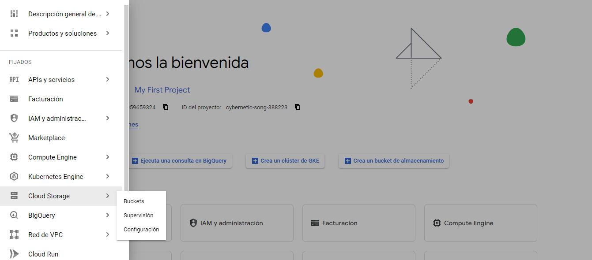
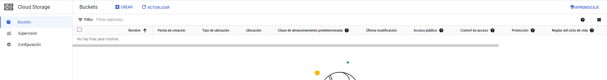
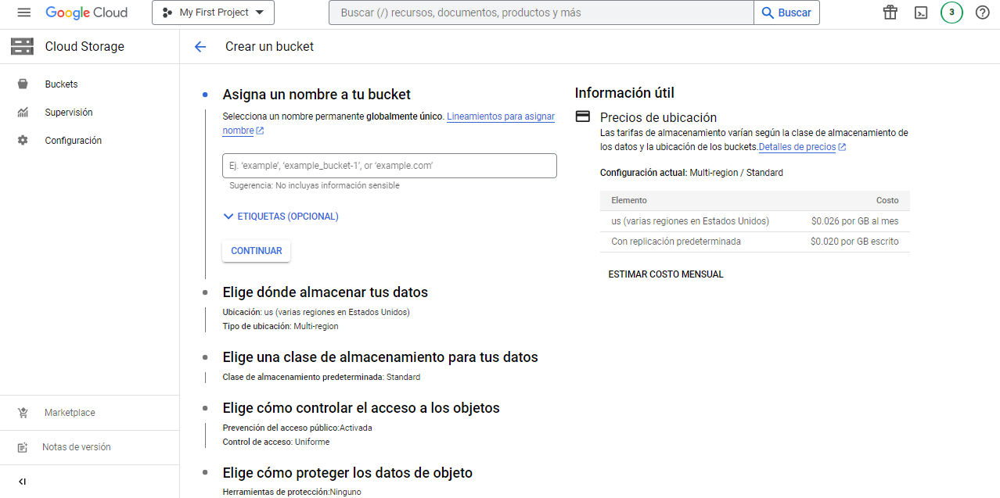
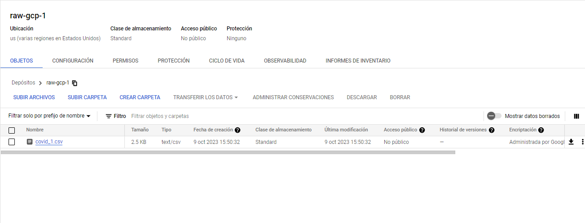
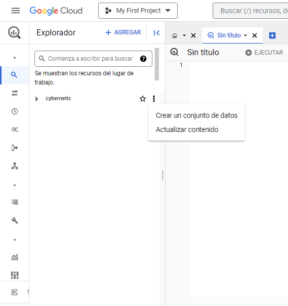
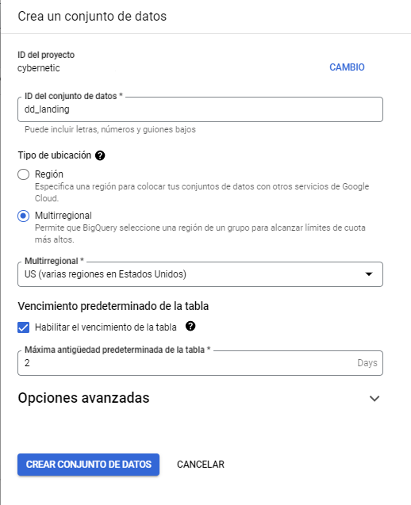

# Ingesta de CSV en BigQuery mediante Bash

<br>

| TABLA DE CONTENIDO     |
| ------------ |
| [Introducción](#Introducción) |
| [Paso 1](#Paso-1) |
| [Paso 2](#Paso-2) |
| [Paso 3](#Paso-3) |
| [Paso 4](#Paso-4) |
| [Paso 5](#Paso-5) |
| [Paso 6](#Paso-6) |
| [Paso 7](#Paso-7) |

<br>


### Introduccion

En este proyecto, se implementa un flujo de trabajo que simplifica la transferencia de datos desde archivos CSV
almacenados en Google Cloud Storage hacia Google BigQuery, todo ello a través de un script Bash. La automatización de
este proceso agiliza la carga y actualización de conjuntos de datos en BigQuery, lo que resulta fundamental en
aplicaciones que requieren análisis de datos en tiempo real o periódico.

El proceso consta de la creación de un bucket en Google Cloud Platform (GCP) para almacenar los archivos CSV, la
creación de un conjunto de datos en BigQuery, la elaboración de un script Bash que realiza la carga de datos, y la
ejecución de dicho script. Además, se incluye la verificación de la correcta creación de la tabla en BigQuery y la
posibilidad de realizar consultas SQL para extraer información específica.

<br>

### Paso 1
-----------

<br>

**Creación de un Bucket en GCP**


<br>

- Ingresa al panel principal de Google Cloud Platform (GCP).
- En la barra lateral, busca la opción "Cloud Storage" y despliega las opciones.
Selecciona "Buckets".
- Presiona el botón "Crear" para crear un nuevo bucket.
- Asigna un nombre al bucket.


<br>








<br>


### Paso 2
-----------

<br>


**Carga de Archivo CSV en el Bucket**


<br>

- Carga el archivo CSV en el bucket que acabas de crear.

<br>




<br>


### Paso 3
-----------


<br>

**Creación de un Conjunto de Datos en BigQuery**

<br>


- Accede a BigQuery en GCP.

<br>




<br>

- Crea un conjunto de datos llamado "dd_landing". Opcionalmente, habilita el vencimiento de la tabla (en este caso, configurado a dos días).

<br>




<br>

### Paso 4
-----------

<br>

**Creación de un Script Bash**

<br>

- Abre la consola de comandos en GCP y crea un archivo de script Bash llamado "bash.sh" utilizando el comando:

<br>

```cmd
nano bash.sh

```


<code style="color: rgb(255, 0, 0); background-color: rgb(0, 0, 0);">nano bash.sh</code>


