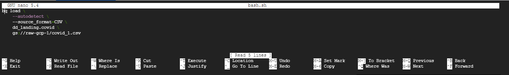
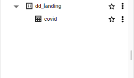
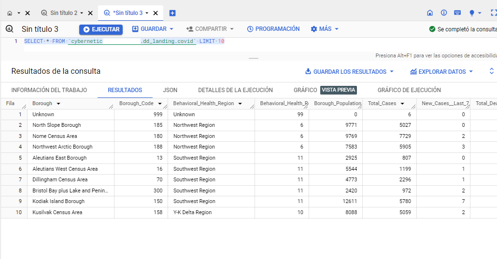
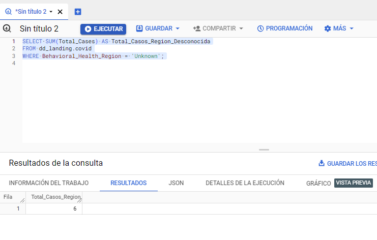
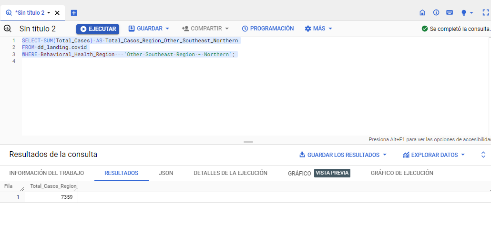

 [# Ingesta de CSV en BigQuery mediante Bash](#Inicio)

<br>

| TABLA DE CONTENIDO     |
| ------------ |
| [Introducción](#Introducción) |
| [Paso 1](#Paso-1) |
| [Paso 2](#Paso-2) |
| [Paso 3](#Paso-3) |
| [Paso 4](#Paso-4) |
| [Paso 5](#Paso-5) |
| [Paso 6](#Paso-6) |
| [Paso 7](#Paso-7) |

<br>


### Introduccion

En este proyecto, se implementa un flujo de trabajo que simplifica la transferencia de datos desde archivos CSV
almacenados en Google Cloud Storage hacia Google BigQuery, todo ello a través de un script Bash. La automatización de
este proceso agiliza la carga y actualización de conjuntos de datos en BigQuery, lo que resulta fundamental en
aplicaciones que requieren análisis de datos en tiempo real o periódico.

El proceso consta de la creación de un bucket en Google Cloud Platform (GCP) para almacenar los archivos CSV, la
creación de un conjunto de datos en BigQuery, la elaboración de un script Bash que realiza la carga de datos, y la
ejecución de dicho script. Además, se incluye la verificación de la correcta creación de la tabla en BigQuery y la
posibilidad de realizar consultas SQL para extraer información específica.

<br>

### Paso 1
-----------

<br>

**Creación de un Bucket en GCP**


<br>

- Ingresa al panel principal de Google Cloud Platform (GCP).
- En la barra lateral, busca la opción "Cloud Storage" y despliega las opciones.
Selecciona "Buckets".
- Presiona el botón "Crear" para crear un nuevo bucket.
- Asigna un nombre al bucket.


<br>


<br>

[Volver inicio :arrow_up:](#Inicio)

<br>

### Paso 2
-----------

<br>


**Carga de Archivo CSV en el Bucket**


<br>

- Carga el archivo CSV en el bucket que acabas de crear.

<br>


<br>


### Paso 3
-----------


<br>

**Creación de un Conjunto de Datos en BigQuery**

<br>


- Accede a BigQuery en GCP.

<br>


<br>

- Crea un conjunto de datos llamado "dd_landing". Opcionalmente, habilita el vencimiento de la tabla (en este caso, configurado a dos días).

<br>


<br>

### Paso 4
-----------

<br>

**Creación de un Script Bash**

<br>

- Abre la consola de comandos en GCP y crea un archivo de script Bash llamado "bash.sh" utilizando el comando:

<br>


```cmd
nano nombre_script.sh

```

<br>

- Luego escribimos el siguiente sccript

<br>

```cmd
  bq load \
    --autodetect \
    --source_format=CSV \
    dd_landing.covid \
    gs://raw-gcp-1/covid_1.csv

```


<br>



<br>

- En el script Bash, carga el archivo CSV llamado "covid_1.csv" desde Google Cloud Storage a una tabla llamada "covid" en el conjunto de datos "dd_landing" en BigQuery. BigQuery determinará automáticamente la estructura de la tabla a partir de los datos en el archivo CSV.


<br>

### Paso 5
-----------

<br>

**Ejecución del Script Bash**

<br>

- Una vez creado el script en Bash, ejecútalo para realizar la carga de datos en BigQuery con el siguiente comando:

<br>

```cmd

bash nombre_script.sh

```

<br>


<br>

### Paso 6
-----------

<br>

**Verificación en BigQuery**

<br>

- Después de que el proceso haya finalizado, verifica en BigQuery que se haya creado la tabla "covid" en tu conjunto de datos "dd_landing".

<br>



<br>

### Paso 7
-----------


<br>


**Consulta de Datos en BigQuery**

<br>


- Consulta basica:

<br>




<br>

- Consultas en BigQuery para analizar los datos. Por ejemplo, utiliza la sentencia SQL para filtrar y contar casos por región:

<br>

**Primer ejemplo**

<br>

```cmd

SELECT SUM(total_cases) AS total_casos_region_desconocida
FROM dd_landing.covid
WHERE Behavioral_health_region = "unknown";

```

<br>

- Ejecucion:

<br>




<br>

- Esta sentencia SQL realizará la suma de los casos totales ("total_cases") que pertenecen a la región con nombre "unknown" en la tabla "covid" dentro del conjunto de datos "dd_landing" en BigQuery. El resultado de la suma se mostrará bajo el alias "total_casos_region_desconocida".


<br>


**Segundo Ejemplo**


<br>


```cmd

SELECT SUM(Total_Cases) AS Total_Casos_Region_Other_Southeast_Northern
FROM nombre_del_conjunto_de_datos.nombre_de_la_tabla
WHERE Behavioral_Health_Region = 'Other Southeast Region - Northern';

```

<br>

- Ejecucion:


<br>





<br>

- Esta sentencia SQL realizará la suma de los casos totales ("Total_Cases") que pertenecen a la región "Other Southeast
Region - Northern" en la tabla de datos específica, que se encuentra en el conjunto de datos también especificado. El
resultado de esta suma se mostrará con el alias "Total_Casos_Region_Other_Southeast_Northern".


<br>


